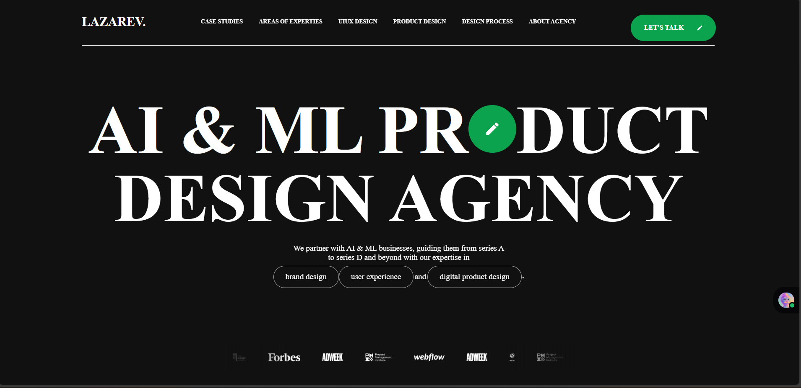

# Lazarev Agency Clone

This project is a front-end clone of the Lazarev Agency website, recreated using HTML, CSS, JavaScript, and enhanced with Locomotive Scroll for smooth scrolling animations. The purpose of the project was to sharpen my front-end skills by replicating a professional, modern, and highly interactive design.

---

## Screenshots

### Homepage

### Mobile View

---

## Features

- Fully responsive layout  
- Navigation menu (desktop & mobile)  
- Hero & banner section with call to action  
- Services / offerings section  
- Portfolio / case studies presentation  
- Testimonials / client feedback slider  
- Contact / “Get in touch” section  
- Scroll/animation effects  
- Footer with social links, address, legal links  

---

## Technologies

- HTML5  
- CSS3 (Flexbox, Grid, Media Queries)  
- JavaScript   

---
